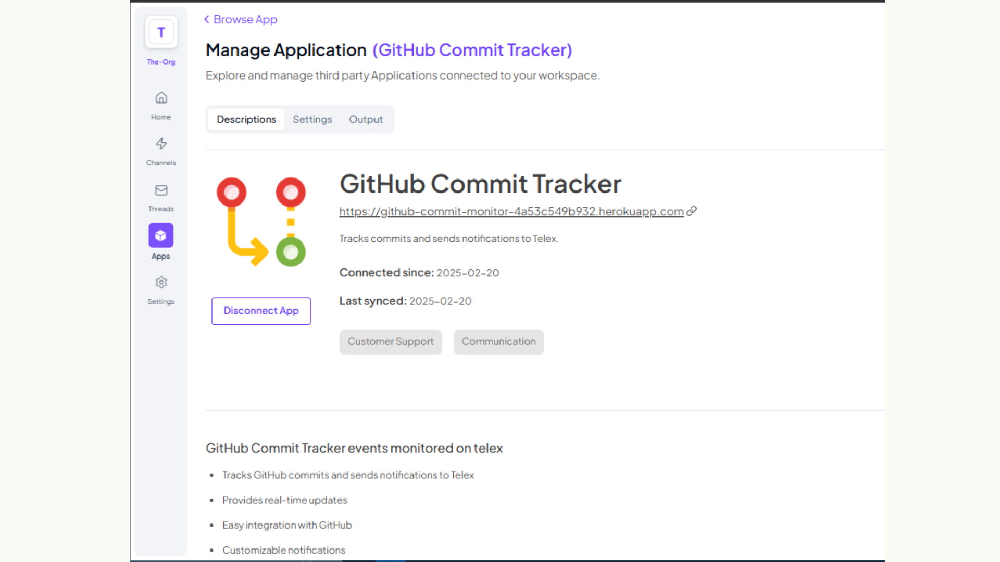
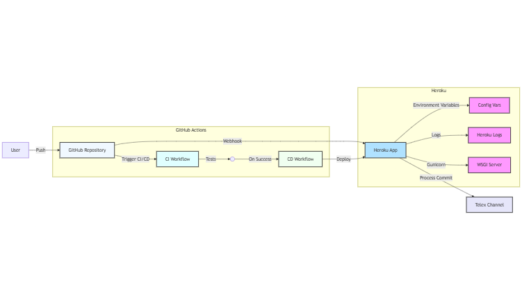
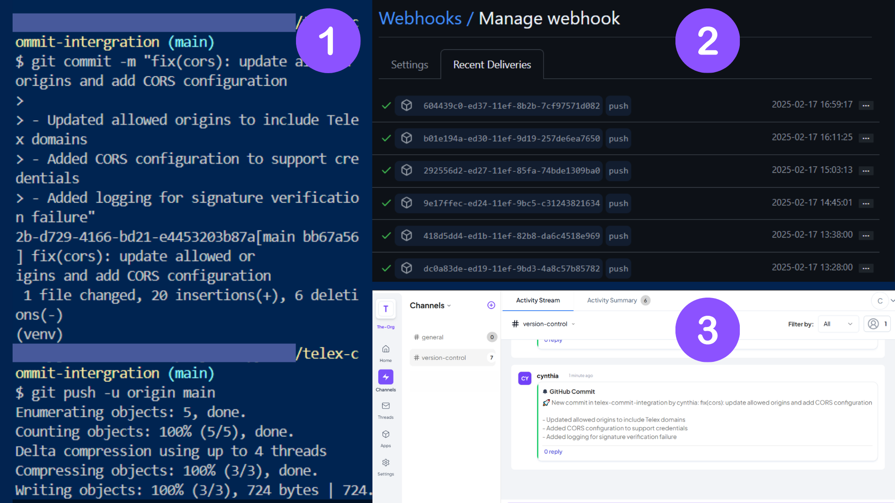

# GitHub Commit Tracker Integration for Telex

A Telex integration that tracks GitHub repository commits and sends real-time notifications to your Telex channel. Built with Python, Flask, and Docker.



## Features

- 🔄 Real-time commit notifications
- 🔐 Secure webhook processing with signature verification
- 🎨 Customizable notification format
- 🚀 Easy integration with GitHub repositories

## Architecture



The integration uses:
- Flask for the webhook endpoint
- Gunicorn as the WSGI server
- GitHub Webhooks for commit tracking
- Heroku for hosting

## Prerequisites

- GitHub repository access
- Telex channel with webhook capability
- Heroku account
- Python 3.9+

## Environment Variables

Configure these environment variables in Heroku:

```plaintext
MY_GITHUB_SECRET=your_github_webhook_secret
CHANNEL_ID=your_telex_channel_id
APP_URL=https://your-app-name.herokuapp.com
```

## Quick Start

1. **Clone the Repository**
   ```bash
   git clone https://github.com/CynthiaWahome/github-commit-monitor
   cd github-commit-monitor
   ```

2. **Deploy to Heroku**
   ```bash
   # Install Heroku CLI if you haven't already
   heroku create your-app-name
   heroku stack:set container
   git push heroku main
   ```

3. **Configure Environment Variables**
   ```bash
   heroku config:set MY_GITHUB_SECRET=your_github_webhook_secret
   heroku config:set CHANNEL_ID=your_telex_channel_id
   heroku config:set APP_URL=https://your-app-name.herokuapp.com
   ```

## GitHub Webhook Setup

1. Go to your GitHub repository settings
2. Navigate to Webhooks > Add webhook
3. Configure webhook:
   - Payload URL: `https://your-app-name.herokuapp.com/github-webhook`
   - Content type: `application/json`
   - Secret: Same as `MY_GITHUB_SECRET`
   - Events: Select "Just the push event"


## Telex Channel Configuration

1. Get your Telex channel ID
2. Add it to your Heroku config variables
3. Test the connection:
   ```bash
   curl -X POST https://your-app-name.herokuapp.com/github-webhook
   ```



## Testing

Run the test suite:
```bash
python -m pytest --cov=app tests/ --cov-report=html
```

Key test areas:
- Webhook signature verification
- Payload processing
- Telex message formatting
- Error handling

## API Endpoints

- `POST /github-webhook`: Receives GitHub commits
- `GET /integration.json`: Integration metadata
- `GET /health`: Health check endpoint

## Troubleshooting

Common issues:
1. **401 Unauthorized**: Check GitHub secret in Heroku config
2. **404 Not Found**: Verify Heroku app URL
3. **Application Error**: Check Heroku logs with `heroku logs --tail`

## Contributing

1. Fork the repository
2. Create a feature branch
3. Submit a pull request

## License

This project is licensed under the MIT License. See the [LICENSE](./LICENSE) file for more details.

## Support

If you encounter any issues or have questions, please feel free to open an issue on our [GitHub Issues](https://github.com/your-repo/issues) page. 

## Contributing

We welcome contributions! Please see our [CONTRIBUTING](./CONTRIBUTING.md) guide for more details on how to get started.

## Code of Conduct

Please note that this project is released with a [Contributor Code of Conduct](./CODE_OF_CONDUCT.md). By participating in this project, you agree to abide by its terms.